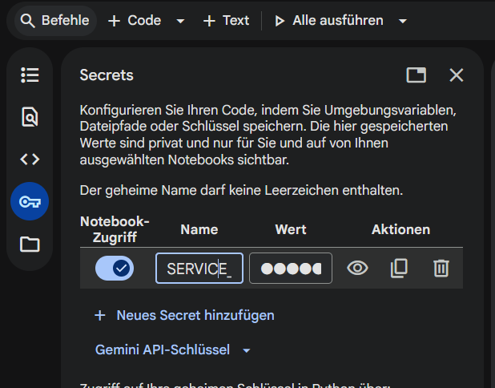

# Abgabe-Data-Science-Gruppe-3
Dies ist der Code unserer Projektleistung im Fach "Vertiefung Data Science"

## Getting Started
Sollten Sie den Code selbst ausführen wollen, so ist Folgendes zu Beachten.

1. Der Code liegt in einem Jupyter Notebook und wurde lediglich in Google Colab entwickelt. Funktionen, wie die interaktive Karte konnten funktionierten über die lokale Ausführung nicht. Wir Empfehlen daher das Notebook in Google Colab auszuführen.
2. Die Anwendung greift auf Google Earth Engine zu, weshalb ein technischer Nutzer erstellt wurde, dessen credentials in der Authentisierung genutzt wurde. Kontaktieren Sie bitte den Administrator, um die Credentials zu bekommen.

### Einrichtung der Credentials

Unter dem Tab "Secrets" können Sie ein neues Secret hinzufügen, wobei Sie `SERVICE_ACCOUNT_CREDENTIALS` als Name eingeben und für den Wert den Inhalt des Key-files, den Sie erhalten haben. Wenn der Schlüssel für das Notebook aktiviert ist, sollte die Authentifizierung funktionieren.
